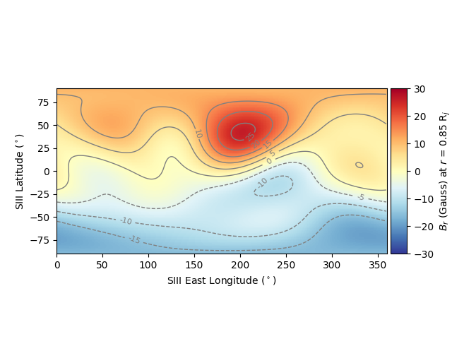

# vip4model
VIP4 model (Connerney et al. 1998) implementation using Python.

## Installation

Install using `pip`:

```bash
pip3 install vip4model --user
```

Or by cloning this repo:

```bash
git clone https://github.com/mattkjames7/vip4model.git
cd vip4model

#EITHER create a wheel and install (replace X.X.X with the version number):
python3 setup.py bdist_wheel
pip3 install dist/vip4model-X.X.X-py3-none-any.whl --user

#OR install directly using setup.py
python3 setup.py install --user
```

## Usage

The model accepts right-handed System III coordinates either in Cartesian form (`vip4model.ModelCart()`) or in spherical polar form (`vip4model.Model()`), e.g.:

```python
import vip4model

#get some Cartesian field vectors (MaxDeg keyword is optional)
Bx,By,Bz = vip4model.ModelCart(x,y,z,MaxDeg=4)

#or spherical polar ones
Br,Bt,Bp = vip4model.Model(r,theta,phi,MaxDeg=4)
```

Please read the docstrings for `vip4model.Model()` and `vip4model.ModelCart()` using `help` or `?` e.g. `help(vip4model.Model)` .

There is also a test function which requires `matplotlib` to be installed:

```python
#evaluate the model at some R
vip4model.Test(R=0.85)
```

which produces this (based on figure 4 of Connerney et al. 2018):




## References

Connerney, J. E. P., Acuña, M. H., Ness, N. F., and Satoh, T. (1998), New models of Jupiter's magnetic field constrained by the Io flux 	tube footprint, J. Geophys. Res., 103( A6), 11929– 11939, doi:10.1029/97JA03726.

Connerney, J. E. P., Kotsiaros, S., Oliversen, R. J., Espley, J. R.,  Joergensen, J. L., Joergensen, P. S., et al. (2018). A new model of Jupiter's magnetic field from Juno's first nine orbits. Geophysical Research Letters, 45, 2590– 2596. https://doi.org/10.1002/2018GL077312

